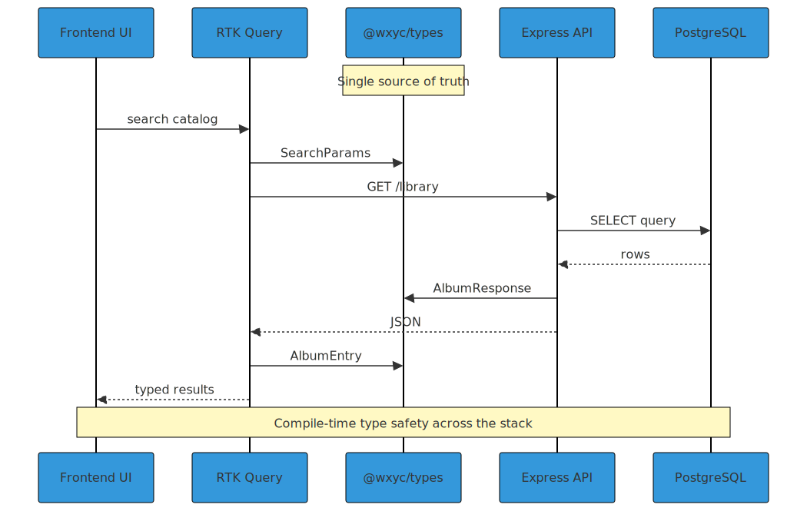

# Technical Proposal: WXYC Shared Infrastructure

**Author:** Engineering Team
**Date:** January 2026
**Status:** Draft
**Stakeholders:** Frontend Team, Backend Team, Mobile Team, QA, DevOps

---

## Executive Summary

This proposal recommends creating a dedicated shared repository (`wxyc-shared`) that serves as the foundation for cross-platform development and testing infrastructure at WXYC. The repository will contain three core packages:

1. **`@wxyc/types`** — OpenAPI-generated type definitions for TypeScript, Kotlin, and Swift
2. **`@wxyc/test-utils`** — Shared test fixtures, factories, and utilities
3. **OpenAPI specification** — Single source of truth for API contracts

Additionally, this proposal covers the implementation of **Playwright-based E2E testing** that leverages these shared packages to provide comprehensive full-stack test coverage.

Currently, the web frontend (dj-site), backend service (Backend-Service), and mobile applications each maintain their own type definitions and test utilities. This duplication creates maintenance burden, increases the risk of runtime errors from type mismatches, and fragments testing infrastructure. By centralizing these concerns, we establish a scalable foundation that supports current platforms, simplifies onboarding future clients, and enables reliable end-to-end testing.

---

## Problem Statement

### Current State

The WXYC application ecosystem consists of multiple codebases that communicate via REST APIs:

- **dj-site** — A React/Next.js web frontend for DJs to manage playlists, search the music catalog, and broadcast shows
- **Backend-Service** — An Express.js API server with PostgreSQL database handling business logic and data persistence
- **Android App** — Native Kotlin mobile application
- **iOS App** — Native Swift mobile application

Each application defines its own types for shared domain concepts. While these types describe the same entities, they are maintained independently with no mechanism to ensure consistency across platforms.



### Specific Issues

**1. Duplicated Type Definitions Across Platforms**

The `Rotation` enum, which defines play frequency categories for albums in rotation, must be defined separately in each codebase:

```typescript
// dj-site (TypeScript)
export enum Rotation { S = "S", L = "L", M = "M", H = "H" }
```

```kotlin
// Android (Kotlin)
enum class Rotation { S, L, M, H }
```

```swift
// iOS (Swift)
enum Rotation: String { case S, L, M, H }
```

```typescript
// Backend-Service (TypeScript)
export const freqEnum = pgEnum('freq_enum', ['S', 'L', 'M', 'H']);
```

Similar duplication exists for album structures, flowsheet entries, user types, and API request/response shapes across all four codebases.

**2. Undefined API Contract**

When any client makes an API request, it constructs request parameters and interprets responses according to its own type definitions. If the backend changes a field name, adds a required field, or modifies a data structure, no client receives any compile-time warning. Errors only surface at runtime, often in production, and may affect platforms differently based on how each implemented the types.

**3. Mobile Release Coordination Challenges**

Unlike web applications that can be deployed instantly, mobile applications require app store review cycles. API changes that break mobile clients can leave users on older app versions unable to use the service until they update. Without a formal contract, it's difficult to assess which API changes are breaking.

**4. Fragmented Test Infrastructure**

Both dj-site and Backend-Service maintain their own test fixtures and factory functions:
- dj-site: `createTestAlbum()`, `createTestUser()` in `lib/test-utils/`
- Backend-Service: Manual test data in `tests/utils/`

These fixtures define similar data structures independently, leading to:
- Duplicated maintenance effort
- Inconsistent test data shapes
- No shared vocabulary for test scenarios

**5. No End-to-End Testing**

There is currently no automated E2E testing that validates the full stack (frontend + backend + database) working together. Issues that span system boundaries are only discovered manually or in production.

### Impact

| Issue | Impact |
|-------|--------|
| Type drift across platforms | Runtime errors, platform-specific bugs |
| Manual API contract maintenance | Developer time spent debugging mismatches |
| Duplicated type definitions | Code duplication across 4+ codebases |
| No formal API versioning | Breaking changes affect mobile users disproportionately |
| Fragmented test utilities | Duplicated effort, inconsistent test data |
| No E2E testing | Integration bugs discovered late, manual QA burden |

---

## Proposed Solution

We propose creating a new repository, `wxyc-shared`, with an OpenAPI specification as the single source of truth. The repository uses automated code generation to produce type-safe packages for each platform, shared test utilities, and serves as the foundation for E2E testing infrastructure.



### Design Principles

**OpenAPI as Single Source of Truth**
The API contract is defined once in OpenAPI (YAML) format. All client types are generated from this specification, eliminating manual synchronization.

**Automated Multi-Platform Generation**
Code generation tools produce idiomatic types for each platform:
- TypeScript types via `openapi-typescript`
- Kotlin data classes via `openapi-generator`
- Swift Codable structs via `openapi-generator`

**Shared Test Infrastructure**
Test fixtures and factories live in `@wxyc/test-utils`, importing types from `@wxyc/types`. All test suites (unit, integration, E2E) share the same vocabulary and data shapes.

**Contract-First Development**
API changes begin with updates to the OpenAPI spec. Generated types ensure all platforms are updated simultaneously, and breaking changes are immediately visible.

### Repository Structure

```
wxyc-shared/
├── openapi/
│   ├── api.yaml                 # OpenAPI specification (source of truth)
│   └── components/
│       └── schemas/
│           ├── album.yaml
│           ├── flowsheet.yaml
│           └── user.yaml
├── packages/
│   ├── types/                   # @wxyc/types
│   │   ├── generated/           # Auto-generated from OpenAPI
│   │   └── src/                 # Hand-crafted domain types, guards
│   ├── test-utils/              # @wxyc/test-utils
│   │   ├── src/
│   │   │   ├── fixtures/        # Test data factories
│   │   │   ├── constants.ts     # Shared test constants
│   │   │   └── index.ts
│   │   └── package.json
│   ├── kotlin/                  # Generated Kotlin data classes
│   └── swift/                   # Generated Swift structs
├── scripts/
│   ├── generate-all.sh
│   ├── generate-typescript.sh
│   ├── generate-kotlin.sh
│   └── generate-swift.sh
├── package.json
└── README.md
```

---

## Package Details

### @wxyc/types

The TypeScript package combines generated types with hand-crafted utilities:

```
packages/types/
├── generated/
│   └── api.ts           # Generated from OpenAPI
├── src/
│   ├── index.ts         # Main exports
│   ├── enums/
│   │   ├── rotation.ts  # Rotation enum with helpers
│   │   └── authorization.ts  # Auth levels with role mapping
│   ├── domain/
│   │   ├── album.ts     # AlbumEntry with nested artist
│   │   └── flowsheet.ts # FlowsheetEntry discriminated union
│   └── guards/
│       └── flowsheet.ts # Type guard functions
└── package.json
```

**Platform-Specific Outputs:**

| Platform | Generator | Output | Distribution |
|----------|-----------|--------|--------------|
| TypeScript | `openapi-typescript` | Type definitions | npm (`@wxyc/types`) |
| Kotlin | `openapi-generator` | Data classes + API client | Maven/Gradle |
| Swift | `openapi-generator` | Codable structs + API client | Swift Package Manager |

### @wxyc/test-utils

Shared test utilities that all test suites can import:

```
packages/test-utils/
├── src/
│   ├── index.ts
│   ├── fixtures/
│   │   ├── album.fixture.ts      # createTestAlbum()
│   │   ├── artist.fixture.ts     # createTestArtist()
│   │   ├── flowsheet.fixture.ts  # createTestFlowsheetEntry()
│   │   ├── user.fixture.ts       # createTestUser(), createTestDJ()
│   │   └── show.fixture.ts       # createTestShow()
│   ├── constants.ts              # TEST_IDS, TEST_TIMESTAMPS, etc.
│   └── time.ts                   # Time manipulation utilities
└── package.json
```

**Fixture Pattern:**

```typescript
// packages/test-utils/src/fixtures/album.fixture.ts
import { AlbumEntry, ArtistEntry } from '@wxyc/types';

export function createTestAlbum(overrides?: Partial<AlbumEntry>): AlbumEntry {
  return {
    id: 1,
    title: "Test Album",
    artist: createTestArtist(),
    entry: 100,
    format: "CD",
    label: "Test Label",
    ...overrides,
  };
}

export function createTestArtist(overrides?: Partial<ArtistEntry>): ArtistEntry {
  return {
    id: 1,
    name: "Test Artist",
    lettercode: "TE",
    numbercode: 1,
    ...overrides,
  };
}
```

**Consumers:**
- dj-site Vitest unit/component tests
- Backend-Service Jest unit/integration tests
- E2E Playwright tests

---

## E2E Testing Infrastructure

E2E tests will live in Backend-Service (which has existing Docker infrastructure) but import from `@wxyc/test-utils` for fixtures.



### E2E Directory Structure

```
Backend-Service/
└── tests/
    └── e2e/
        ├── playwright.config.ts
        ├── global-setup.ts
        ├── fixtures/
        │   ├── auth.fixture.ts      # Playwright auth helpers
        │   ├── db.fixture.ts        # Database helpers (uses @wxyc/test-utils)
        │   └── index.ts
        ├── pages/
        │   ├── login.page.ts
        │   ├── dashboard.page.ts
        │   ├── flowsheet.page.ts
        │   └── catalog.page.ts
        └── tests/
            ├── smoke.spec.ts
            ├── auth/
            │   ├── login.spec.ts
            │   └── logout.spec.ts
            ├── flowsheet/
            │   ├── add-entry.spec.ts
            │   └── show-lifecycle.spec.ts
            ├── catalog/
            │   └── search.spec.ts
            └── admin/
                └── roster.spec.ts
```

### Docker Orchestration

The E2E environment uses Docker Compose with a dedicated `e2e` profile:

```yaml
# dev_env/docker-compose.yml (e2e profile additions)
services:
  e2e-db:
    image: postgres:15
    ports: ["5435:5432"]
    profiles: ["e2e"]

  e2e-backend:
    build: .
    depends_on: [e2e-db]
    profiles: ["e2e"]

  e2e-frontend:
    build:
      context: ../../dj-site
      dockerfile: ../Backend-Service/dev_env/Dockerfile.frontend
    profiles: ["e2e"]
```

### Test Suites

| Suite | Coverage |
|-------|----------|
| **Smoke** | App loads, API health, auth redirects |
| **Authentication** | Login, logout, protected routes |
| **Flowsheet** | Start show, add entries, reorder, end show |
| **Catalog** | Search, album details, add to bin/flowsheet |
| **Admin** | Roster access (SM only), DJ management |

### E2E Fixtures Using Shared Types

```typescript
// Backend-Service/tests/e2e/fixtures/db.fixture.ts
import { createTestAlbum, createTestShow } from '@wxyc/test-utils';
import { AlbumEntry } from '@wxyc/types';

export async function seedTestAlbum(db: Database, overrides?: Partial<AlbumEntry>) {
  const album = createTestAlbum(overrides);
  await db.insert('library', album);
  return album;
}
```

---

## Type Flow

The following diagram illustrates how shared types flow through a typical API request:



**Generation Workflow:**

1. Developer modifies `openapi/api.yaml`
2. CI pipeline runs code generation for all platforms
3. Generated packages are versioned and published
4. Each client application updates to the new version
5. Compile-time errors surface any breaking changes

---

## Benefits

### Quantifiable Improvements

| Metric | Current | Proposed | Improvement |
|--------|---------|----------|-------------|
| Type definitions per API endpoint | 4 (one per platform) | 1 (generated) | 75% reduction |
| Platforms with compile-time safety | 0 | 4 | Full coverage |
| API documentation | Manual/outdated | Auto-generated | Always current |
| Time to propagate API changes | Hours (manual) | Minutes (automated) | ~90% faster |
| Test fixture definitions | 2+ (per repo) | 1 (shared) | Unified |
| E2E test coverage | 0% | Core user flows | New capability |

### Qualitative Benefits

**Safer Refactoring**
Changing a field in the OpenAPI spec immediately surfaces all affected code across every platform through compile errors. No more "works on web, breaks on mobile" surprises.

**Foundation for Tooling**
The OpenAPI spec enables additional tooling: Swagger UI for interactive documentation, mock servers for frontend development, contract testing, and automated SDK generation for future platforms.

**Faster Onboarding**
New team members (and new platforms) can understand the API by reading a single, well-documented specification rather than reverse-engineering multiple codebases.

**Mobile Release Confidence**
With a formal contract, teams can assess whether API changes are backwards-compatible before deployment, reducing the risk of breaking older mobile app versions.

**Consistent Test Data**
All test suites use the same fixtures, ensuring test data accurately reflects production shapes and reducing "works in tests, fails in prod" scenarios.

**Full-Stack Validation**
E2E tests catch integration issues that unit tests miss, validating that frontend, backend, and database work together correctly.

---

## Implementation Plan

### Phase 1: Repository Setup and OpenAPI Migration

Create the `wxyc-shared` repository and migrate the existing `app.yaml` from Backend-Service into a well-structured OpenAPI specification.

**Tasks:**
- Initialize repository with npm workspaces
- Migrate and organize existing OpenAPI spec from Backend-Service
- Set up code generation scripts for TypeScript
- Configure CI pipeline for automated generation

**Deliverables:**
- Repository with `openapi/` and `packages/types/` structure
- TypeScript generation working end-to-end
- CI pipeline publishing to npm (or git-based dependency)

### Phase 2: @wxyc/types Migration

Migrate dj-site and Backend-Service to use generated types, supplemented with hand-crafted domain types.

**Tasks:**
- Generate TypeScript types from OpenAPI
- Create hand-crafted domain types and guards
- Update dj-site imports to use `@wxyc/types`
- Update Backend-Service to validate against shared types
- Remove duplicated type definitions

**Deliverables:**
- Both TypeScript applications using shared types
- Zero duplicated type definitions
- All existing tests passing

### Phase 3: @wxyc/test-utils Package

Create the shared test utilities package by consolidating existing fixtures.

**Tasks:**
- Create `packages/test-utils/` structure
- Migrate fixtures from dj-site (`lib/test-utils/`)
- Migrate fixtures from Backend-Service (`tests/utils/`)
- Ensure fixtures import from `@wxyc/types`
- Update both repos to import from `@wxyc/test-utils`

**Deliverables:**
- Working `@wxyc/test-utils` package
- dj-site tests using shared fixtures
- Backend-Service tests using shared fixtures

### Phase 4: E2E Infrastructure Setup

Set up Playwright and Docker infrastructure for E2E testing.

**Tasks:**
- Install Playwright in Backend-Service
- Create `tests/e2e/` directory structure
- Create `playwright.config.ts`
- Add e2e profile to docker-compose.yml
- Create Dockerfile for frontend
- Implement global setup (wait for services)

**Deliverables:**
- Playwright configured and runnable
- Docker e2e profile starting all services
- Smoke test passing

### Phase 5: E2E Test Suites

Implement core E2E test suites using shared fixtures.

**Tasks:**
- Implement auth fixture (Cognito login)
- Implement db fixture (using `@wxyc/test-utils`)
- Create page objects (login, dashboard, flowsheet, catalog)
- Write authentication tests
- Write flowsheet tests
- Write catalog tests
- Write admin tests

**Deliverables:**
- Complete E2E test coverage for core flows
- All tests passing locally
- Page objects documented

### Phase 6: CI Integration and Mobile Codegen

Integrate E2E into CI and set up mobile code generation.

**Tasks:**
- Create GitHub workflow for E2E tests
- Configure `openapi-generator` for Kotlin
- Configure `openapi-generator` for Swift
- Integrate generated types into mobile apps
- Set up breaking change detection

**Deliverables:**
- E2E tests running in CI on PRs
- Kotlin package generating correctly
- Swift package generating correctly
- Breaking change alerts in CI

### Phase 7: Documentation and Workflow

Establish documentation, contribution guidelines, and ongoing workflows.

**Tasks:**
- Generate Swagger UI / Redoc documentation site
- Write contribution guide for API changes
- Document code generation workflow
- Document E2E test writing guide
- Update README files in all repos

**Deliverables:**
- Interactive API documentation
- Clear process for API modifications
- E2E testing documented

---

## Risk Assessment

| Risk | Likelihood | Impact | Mitigation |
|------|------------|--------|------------|
| Generated types don't match desired structure | Medium | Medium | Customize generator templates, supplement with hand-crafted types |
| OpenAPI spec maintenance burden | Medium | Low | Spec is already partially maintained; tooling validates correctness |
| Breaking changes during migration | Medium | High | Incremental migration, comprehensive testing |
| E2E tests flaky/slow | Medium | Medium | Selective cleanup, parallel execution, retry logic |
| Mobile team adoption friction | Low | Medium | Generated types are idiomatic; reduces their maintenance burden |
| Docker complexity for E2E | Low | Low | Build on existing docker-compose infrastructure |

---

## Alternatives Considered

### Alternative 1: Hand-Crafted Types Only (TypeScript)

Manually maintain TypeScript types in a shared package without OpenAPI.

**Pros:** Full control over type structure, no generator complexity
**Cons:** Doesn't help mobile platforms, still requires manual synchronization for Kotlin/Swift

**Decision:** Rejected. Does not address the multi-platform problem.

### Alternative 2: Keep Infrastructure in Separate Repos

Maintain types, test-utils, and E2E separately without a unified shared repo.

**Pros:** Simpler initial setup, independent versioning
**Cons:** Coordination overhead, harder to ensure consistency, scattered documentation

**Decision:** Rejected. Unified repo provides better cohesion and discoverability.

### Alternative 3: GraphQL with Codegen

Adopt GraphQL and use codegen to generate types from the schema.

**Pros:** Strongly typed by design, excellent multi-platform tooling
**Cons:** Significant architectural change, learning curve, migration cost

**Decision:** Rejected for this scope. OpenAPI achieves similar benefits with less disruption. GraphQL could be revisited for future API evolution.

### Alternative 4: Protobuf / gRPC

Use Protocol Buffers for schema definition and code generation.

**Pros:** Excellent multi-platform support, efficient binary format, strong versioning
**Cons:** Requires API rewrite to gRPC or REST+protobuf, runtime library overhead, overkill for current scale

**Decision:** Rejected. OpenAPI fits existing REST architecture better.

---

## Resource Requirements

### Development Effort

| Phase | Estimated Effort | Team |
|-------|------------------|------|
| Repository setup + OpenAPI migration | 8 hours | DevOps + Backend |
| @wxyc/types migration | 16 hours | Frontend + Backend |
| @wxyc/test-utils package | 8 hours | Frontend + Backend |
| E2E infrastructure setup | 8 hours | DevOps + QA |
| E2E test suites | 16 hours | QA + Frontend |
| CI integration + mobile codegen | 12 hours | DevOps + Mobile |
| Documentation + workflow | 8 hours | All |
| **Total** | **76 hours** | |

### Ongoing Maintenance

- API changes update OpenAPI spec first (~15 min per change)
- Code generation runs automatically in CI
- Version bumps coordinated with application releases
- E2E tests maintained alongside feature development
- Generator updates tested quarterly

---

## Success Metrics

We will measure success through:

1. **Platform Coverage** — All 4 platforms using generated/shared types
2. **Duplication Elimination** — Zero manually-maintained API types in client repos
3. **Test Fixture Consolidation** — Single source for all test factories
4. **E2E Coverage** — Core user flows covered by automated tests
5. **Documentation Currency** — API docs always match implementation
6. **Breaking Change Detection** — 100% of breaking changes caught before deployment
7. **CI Reliability** — E2E tests passing consistently (>95% success rate)

---

## Conclusion

Creating `wxyc-shared` with OpenAPI-driven code generation and unified test infrastructure addresses multiple fundamental challenges: type consistency across platforms, fragmented test utilities, and lack of E2E validation. While these could be addressed separately, combining them into a single initiative provides:

- **Cohesion** — Types, test utils, and E2E tests share the same vocabulary
- **Efficiency** — One repository to maintain, one CI pipeline to configure
- **Discoverability** — All shared infrastructure in one place

By investing approximately 76 hours of development effort, we eliminate type duplication across four platforms, unify test infrastructure, and establish automated E2E testing. The OpenAPI specification provides immediate value through auto-generated documentation and enables future tooling like mock servers and contract testing.

We recommend proceeding with the implementation plan outlined above, completing shared types first (Phases 1-3), then building E2E testing on that foundation (Phases 4-6).

---

## Appendix

### A. OpenAPI Tooling

| Tool | Purpose | Platform |
|------|---------|----------|
| `openapi-typescript` | Generate TypeScript types | Web |
| `openapi-generator` | Generate Kotlin/Swift | Mobile |
| `@redocly/cli` | Lint and bundle OpenAPI specs | All |
| `swagger-ui` | Interactive API documentation | All |

### B. E2E Test Configuration

**Playwright Config Highlights:**
```typescript
// playwright.config.ts
export default defineConfig({
  testDir: './tests/e2e/tests',
  fullyParallel: true,
  retries: process.env.CI ? 2 : 0,
  use: {
    baseURL: 'http://localhost:3000',
    trace: 'on-first-retry',
  },
  projects: [{ name: 'chromium', use: { ...devices['Desktop Chrome'] } }],
  webServer: {
    command: 'docker compose --profile e2e up',
    url: 'http://localhost:3000',
    reuseExistingServer: !process.env.CI,
  },
});
```

### C. Type Inventory

Types to be defined in OpenAPI and generated:

| Type | Description | Platforms |
|------|-------------|-----------|
| `Rotation` | Play frequency enum (S, L, M, H) | All |
| `Authorization` | Permission levels | All |
| `AlbumResponse` | Album search result | All |
| `FlowsheetEntry` | Playlist entry | All |
| `User` | User profile | All |
| `CreateAlbumRequest` | Album creation params | Web, potentially mobile |
| `OnAirResponse` | Current broadcast status | All |

### D. E2E Test Suites Detail

| Suite | Tests |
|-------|-------|
| **Smoke** | App loads, login page accessible, API health, auth redirects |
| **Auth** | Successful login, failed login, logout, protected routes |
| **Flowsheet** | Start show, add from catalog, add from bin, reorder, end show |
| **Catalog** | Search by artist, search by album, view details, add to bin |
| **Admin** | SM accesses roster, DJ denied roster, view DJ list |

### E. Related Documentation

- [OpenAPI Specification](https://spec.openapis.org/oas/latest.html)
- [openapi-typescript](https://github.com/drwpow/openapi-typescript)
- [OpenAPI Generator](https://openapi-generator.tech/)
- [Playwright Documentation](https://playwright.dev/)
